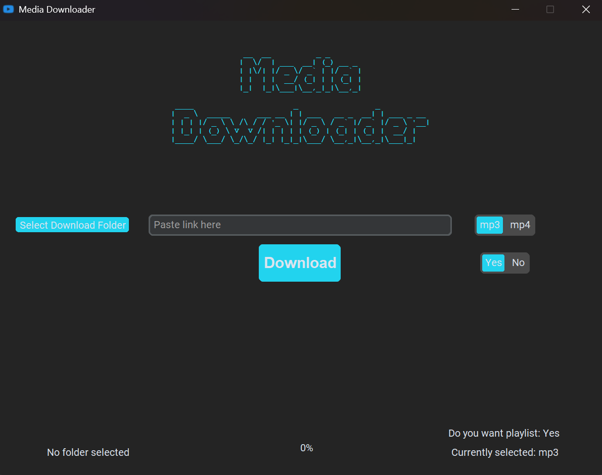

# MediaDownloader

Simple open-source application for Windows and Linux.

Download media as MP3 or MP4 from various platforms (YouTube, TikTok, Instagram Reels, etc.).

Download single videos or full playlists.

## Features

- MP3 and MP4 downloads
- Single video downloads
- Full playlist downloads
- Playlist toggle
- Windows and Linux support

## Supported Platforms

MediaDownloader supports a wide range of websites through yt-dlp.

Tested with:

- YouTube
- TikTok
- Instagram Reels
- Reddit
- Websites with directly accessible media

Many other websites supported by yt-dlp may also work.

## Screenshot




## Windows

[**Download MediaDownloader for Windows**](https://github.com/DebianEnjoyer/MediaDownloader/releases/latest/download/MediaDownloader.exe)

Download the `.exe` file and run it.

> **Note:** The application is currently unsigned, so Windows SmartScreen may display a warning when launching it.

## Linux

[**Download MediaDownloader for Linux**](https://github.com/DebianEnjoyer/MediaDownloader/releases/latest/download/MediaDownloader-x86_64.AppImage)

After downloading, make the `.AppImage` executable:

```bash
chmod +x MediaDownloader-x86_64.AppImage
```

Then run it from your desktop or terminal:

```bash
./MediaDownloader-x86_64.AppImage
```

## Built With

- Python
- yt-dlp
- FFmpeg
- CustomTkinter

## Running from Source

Clone the repository and install the dependencies:

```bash
pip install -r requirements.txt
```

Then run the application:

```bash
python window.py
```

On Linux, use:

```bash
python3 window.py
```

## Bug Reports

Found a bug or something isn't working as expected?

Please open an issue and describe the problem.

## License

This project is licensed under the MIT License.
